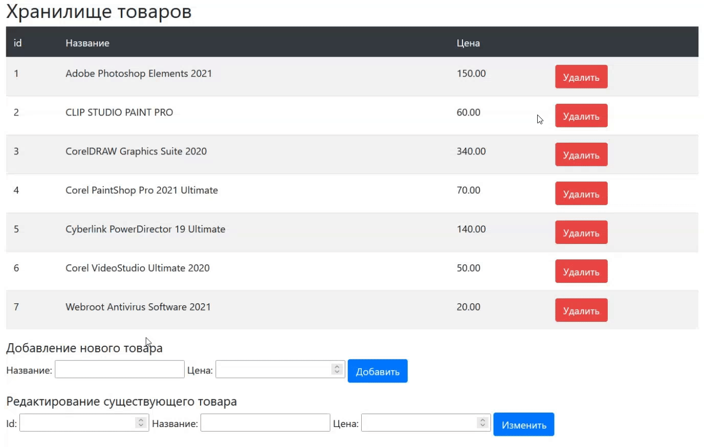

# Spring Product Storage

Хранилище товаров с CRUD-операциями и веб-взаимодействием на основе микросервисной архитектуры.



## Описание

"Spring Product Storage" позволяет при помощи веб-сервиса взаимодействовать с хранилищем
товаров по API и выполнять основные CRUD-операции над сущностями.

Проект построен на основе микросервисной архитектуры и состоит из следующих модулей:
1. eureka-server - Discovery Server для регистрации микросервисов, являющиеся экземплярами Eureka;
2. product-service - микросервис, отвечающий за взаимодействие с БД и обладающий основными CRUD-операциями, взаимодействие с которым происходит при помощи API;
3. front-service - микросервис, предоставляющий пользователю способ взаимодействия с хранилищем товаров ("product-service") через
   веб-интерфейс. Взаимодействие с API микросервиса "product-service" происходит при помощи декларативного
   HTTP-клиента OpenFeign;
4. common - модуль для передачи данных между микросервисами приложения, содержащий общую сущность в виде DTO товаров.

Структура проекта в виде UML диаграммы классов представлена по следующей [ссылке](./assets/uml_diagram_spring_ps.svg).

## Установка

Для запуска проекта выполните следующие действия:
1. Клонируйте проект:
   ```
   $ git clone https://github.com/phenomiks/spring-cloud-market.git
   ```
2. Соберите проект:
   ```
   mvn clean install
   ```
3. Запустите каждый модуль:
   ```
   java -jar eureka-server-1.0.0.jar
   java -jar product-service-1.0.0.jar
   java -jar front-service-1.0.0.jar
   ```   
4. Основная страницу будет доступна по адресу:
   [localhost:8190/products](http://localhost:8190/products)
   
## Лицензия

[MIT](./LICENSE)

<br>

---


#### Используемый стек технологий:

---

Java 11, Spring Boot, Spring Cloud (Spring Cloud Netflix, OpenFeign),
Spring Web MVC, Spring Data JPA, H2 Database, Flyway, Thymeleaf, Maven, Lombok

